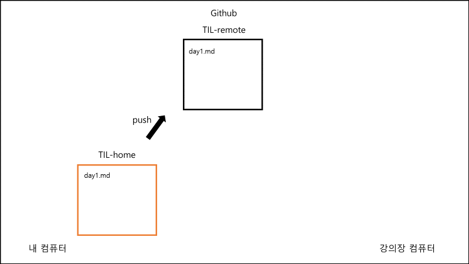

# Git 기초

## [1] Git 초기 설정 

- 최초 한 번만 설정

​		`$ git config --global user.name "이름"`

​		`$ git config --global user.email "메일 주소"`


- 작성자가 올바르게 설정되었는지 확인

  ```bash
  $ git config --global -l
  또는
  $ git config --global --list
  ```
  
  

## [2] Git 기본 명령어

### (0) 로컬 저장소

- `Working Directory (= Working Tree)` : 사용자의 일반적인 작업이 일어나는 곳
- `Staging Area (= Index)` : 커밋을 위한 파일 및 폴더가 추가되는 곳
- `Repository` : staging area에 있던 파일 및 폴더의 변경사항(커밋)을 저장하는 곳
- Git은 **Working Directory → Staging Area → Repository** 의 과정으로 버전 관리를 수행한다.

### (1) git init

```bash
$ git init
```

- 현재 작업 중인 디렉토리를 Git으로 관리한다는 명령어

<aside> ❗ **주의 사항**


1. 이미 Git 저장소인 폴더 내에 또 다른 Git 저장소를 만들지 않습니다. (중첩 금지) 즉, 터미널에 이미 (master)가 있다면, git init을 절대 입력하면 안됩니다.
2. 절대로 홈 디렉토리에서 git init을 하지 않습니다. 터미널의 경로가 `~` 인지 확인합니다.


### (2) git status

```bash
$ git status
```

- Working Directory와 Staging Area에 있는 파일의 현재 상태를 알려주는 명령어


### (3) git **add**

```bash
# 특정 파일

$ git add a.txt

# 특정 폴더

$ git add my_folder/

# 현재 디렉토리에 속한 파일/폴더 전부

$ git add .
```

- Working Directory에 있는 파일을 Staging Area로 올리는 명령어


### (4) git **commit**

```bash
$ git commit -m "first commit"
```

- Staging Area에 올라온 파일의 변경 사항을 하나의 버전(커밋)으로 저장하는 명령어


### (5) **git log**

```bash
$ git log
```

- 커밋의 내역(`ID, 작성자, 시간, 메세지 등`)을 조회할 수 있는 명령어

- 옵션

  - `--oneline` : 한 줄로 축약해서 보여준다.

  - `--graph` : 브랜치와 머지 내역을 그래프로 보여준다.

  - `--all` : 현재 브랜치를 포함한 모든 브랜치의 내역을 보여준다.

  - `--reverse` : 커밋 내역의 순서를 반대로 보여준다. (최신이 가장 아래)

  - `-p` : 파일의 변경 내용도 같이 보여준다.

  - `-2` : 원하는 갯수 만큼의 내역을 보여준다. (2 말고 임의의 숫자 사용 가능)	

		 💡 **옵션과 인자**

**옵션**은 명령어의 동작 방식을 지정하는 것입니다. 따라서 **생략 가능**하다.

**인자**는 명령어의 동작 대상을 지정하는 것입니다. 따라서 **생략이 불가능** 하다.


# .gitignore

> 특정 파일 혹은 폴더에 대해 Git이 버전 관리를 하지 못하도록 지정하는 것

### (1) .gitignore에 작성하는 목록

- 민감한 개인 정보가 담긴 파일 (전화번호, 계좌번호, 각종 비밀번호, API KEY 등)
- OS(운영체제)에서 활용되는 파일
- IDE(통합 개발 환경 - pycharm) 혹은 Text editor(vscode) 등에서 활용되는 파일
  - 예) pycharm -> .idea/
- 개발 언어(python) 혹은 프레임워크(django)에서 사용되는 파일
  - 가상 환경 : `venv/`
  - `__pycache__/`

### (2) .gitignore 작성 시 주의 사항

- 반드시 이름을 `.gitignore`로 작성한다. 앞의 점(.)은 숨김 파일이라는 뜻이다.

- `.gitignore` 파일은 `.git` 폴더와 동일한 위치에 생성한다.

- **제외 하고 싶은 파일은 반드시 `git add` 전에 `.gitignore`에 작성한다.**

  <aside> ❗ **왜 git add 전에 .gitignore에 작성해야 할까?**

  `git add a.txt` 라고 작성하면, 이제 Git은 `a.txt`를 버전 관리의 대상으로 여긴다. 한 번 버전 관리의 대상이 된 `a.txt`는 이후에 .gitignore에 작성하더라도 무시되지 않고 계속 버전 관리의 대상으로 인식된다.

  따라서 제외 하고 싶은 파일은 반드시 git add 전에 .gitignore에 작성해야 한다!

  </aside>

### (3) .gitignore 쉽게 작성하기

> .gitignore의 내용을 쉽게 작성할 수 있도록 도와주는 두 개의 사이트를 소개한다. 자신의 개발 환경에 맞는 것을 찾아서 `전체 복사, 붙여넣기`를 하면 된다.

1. **웹사이트**

[gitignore.io](https://gitignore.io/)

2. **gitignore 저장소**

https://github.com/github/gitignore


# CLONE & PULL

## [1] 원격 저장소 가져오기

### (1) git clone

- 원격 저장소의 커밋 내역을 모두 가져와서, 로컬 저장소를 생성하는 명령어

  ```bash
  $ git clone 원격 저장소 주소
  ```

- git clone을 통해 생성된 로컬 저장소는 `git init`과 `git remote add`가 이미 수행되어 있다.


### (2) git pull

- 원격 저장소의 변경 사항을 가져와서, 로컬 저장소를 업데이트하는 명령어

- `git pull <저장소 이름> <브랜치 이름>`의 형태로 작성

  ```bash
  $ git pull origin master
  [해석] git 명령어를 사용할건데, origin이라는 원격 저장소의 master 브랜치의 내용을 가져온다(pull).
  ```

<aside> 💡 **git clone vs git pull**


clone과 pull이 모두 원격 저장소로부터 가져오는 명령어라서 조금 혼동될 수 있다.

`git clone`은 git init처럼 처음에 한 번만 실행한다. 즉 로컬 저장소를 만드는 역할이다. 단, git init처럼 직접 로컬 저장소를 만드는 게 아니라, Github에서 저장소를 복제해서 내 컴퓨터에 똑같은 복제본을 만든다는 차이가 있다.

`git pull`은 git push처럼 로컬 저장소와 원격 저장소의 내용을 동기화하고 싶다면 언제든 사용한다. 단, push는 로컬 저장소의 변경 내용을 원격 저장소에 반영하는 것이고, pull은 원격 저장소의 변경 내용을 로컬 저장소에 반영하는 것이다. **즉 방향이 다르다!**

</aside>

## [2] 내 컴퓨터 ↔ Github(원격 저장소) ↔ 강의장 컴퓨터

### (1) 규칙

- 내 컴퓨터에 있는 로컬 저장소의 이름은 `TIL-home` 이다.
- 강의장 컴퓨터에 있는 로컬 저장소의 이름은 `TIL-class` 이다.
- Github에 있는 원격 저장소의 이름은 `TIL-remote` 이다.

### (2) 사전 세팅

- 홈 디렉토리 안에 `TIL-home` 폴더를 생성한다.

- Github에서 `TIL-remote` 라는 이름의 원격 저장소를 생성한다.

- `TIL-home` 폴더에서 vscode를 연다.

- 아래와 같은 절차를 진행한다.

  ```bash
  # TIL-home
  
  $ git init
  $ touch day1.md
  $ git add .
  $ git commit -m "집에서 Day1 작성"
  $ git remote add origin 원격저장소주소
  $ git push origin master
  ```

  `TIL-home` 로컬 저장소의 내용이 `TIL-remote` 원격 저장소에 그대로 반영되었다.

- 결과

  

### (3) git clone

> 이제 강의장에 왔고, 강의장 컴퓨터에는  TIL 폴더가 없다고 가정한다.

- Github에 있는 `TIL-remote`에서 `git clone`을 통해 내려 받는다.

  ```bash
  # TIL-class
  
  $ git clone 원격저장소주소
  ```

  **원격 저장소는 `TIL-remote` 이지만, 위와 같이 작성하면 강의장 컴퓨터에는 `TIL-class`라는 이름으로 로컬 저장소가 생성된다. (내부 파일 내용은 똑같다. 단지 폴더의 이름만 바뀐다.)**

- 결과

  

### (4) git push

> 강의장 컴퓨터 → 원격 저장소

- 강의장에서 새로운 파일을 만들고 원격 저장소에 업로드 합니다.

  ```bash
  # TIL-class
  
  $ touch day2.md
  $ git add .
  $ git commit -m "강의장에서 Day2 작성"
  $ git push origin master
  ```

- 결과

  

### (5) git pull

> 원격 저장소 → 내 컴퓨터

- 내 컴퓨터에는 day2.md가 없습니다. 왜냐하면 강의장 컴퓨터에서 day2.md를 만들어서 원격 저장소에 push 했기 때문입니다. 따라서 원격 저장소에서 day2.md에 대한 내역을 가져와야 합니다.

  ```bash
  # TIL-home
  
  $ git pull origin master
  ```

- 

  

  이제 `내 컴퓨터, Github, 강의장 컴퓨터`의 내용은 동일하다.

- **주의 사항

  <aside> ❗ **만약 TIL-home에서 pull이 아니라 commit을 먼저한 후 pull을 하면 어떻게 될까? 다음 세 가지의 경우가 있을 수 있다.**


  1. 내 컴퓨터와 강의장 컴퓨터에서 **서로 다른 파일을 수정**한 경우 → 정상적으로 git pull이 된다.
  2. 내 컴퓨터와 강의장 컴퓨터에서 **같은 파일을 수정했지만, 수정한 라인이 다른** 경우 → 정상적으로 git pull이 된다.
  3. 내 컴퓨터와 강의장 컴퓨터에서 **같은 파일의 같은 라인**을 수정한 경우 → **충돌(conflict)**이 발생합니다. 어느 내용을 반영할지 직접 선택해야 한다.

  </aside>

  <aside> ❗ **만약 TIL-home에서 pull이 아니라 commit을 먼저한 후 바로 push 하면 어떻게 될까?** **아래와 같은 에러 메시지가 나타나면서 push가 실패한다.**


  To URL

  ! [rejected]     master -> master (non-fast-forward)

  error: failed to push some refs to 'URL'

  원격 저장소의 내용을 먼저 받아오지 않고, 로컬 저장소에서 새로운 커밋을 생성했기 때문에 서로의 커밋 내역이 달라져서 그렇다.

  만약 로컬 저장소와 원격 저장소의 내용이 다르다면 일단 git pull을 통해 동기화를 시키고 새로운 커밋을 쌓아 나가야 한다.

  </aside>

